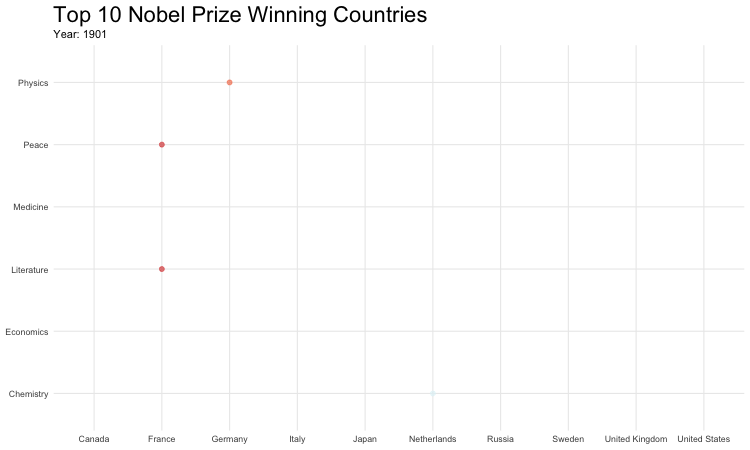
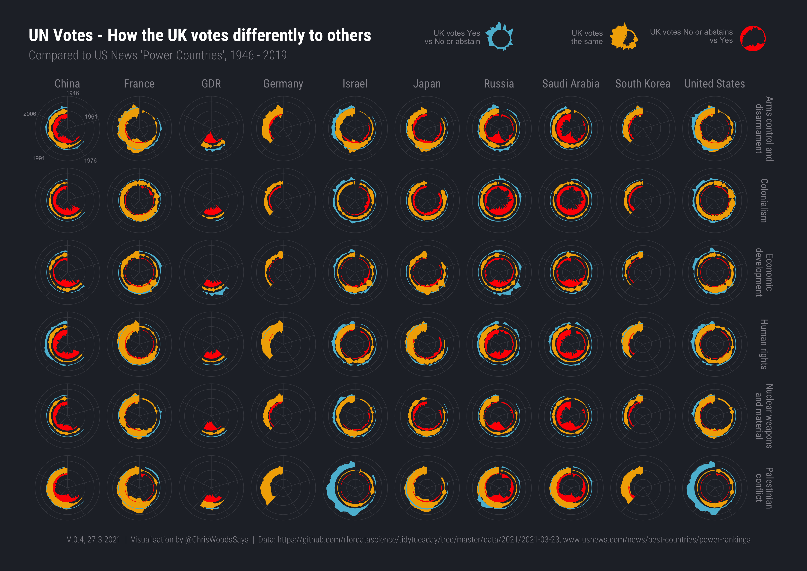

# TidyTuesday

### [2019-05-20](https://github.com/rfordatascience/tidytuesday/tree/master/data/2019/2019-05-14)  Nobel Prizes

A simple animation of Nobel Prizes over time, by country and prize, for the most commonly awarded countries.

 
 

### [2021-03-23](https://github.com/rfordatascience/tidytuesday/tree/master/data/2021/2021-03-23) UN Votes - How the UK votes differently to others

Chart showing how the UK votes differently to the 10 'most powerful' countries listed by [US News' Power Rankings](https://www.usnews.com/news/best-countries/power-rankings).  Voting data is taken from [Harvard's Dataverse](https://dataverse.harvard.edu/dataset.xhtml?persistentId=hdl:1902.1/12379) via the [{unvotes} R package](https://cran.r-project.org/web/packages/unvotes/unvotes.pdf).

Colours taken from the [Wes Anderson](https://github.com/karthik/wesanderson) Darjeeling palette.

I like how each chart is reminiscent of the UN emblem.&nbsp;&nbsp;&nbsp;

